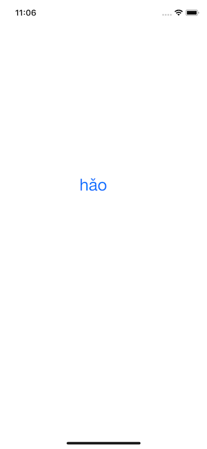
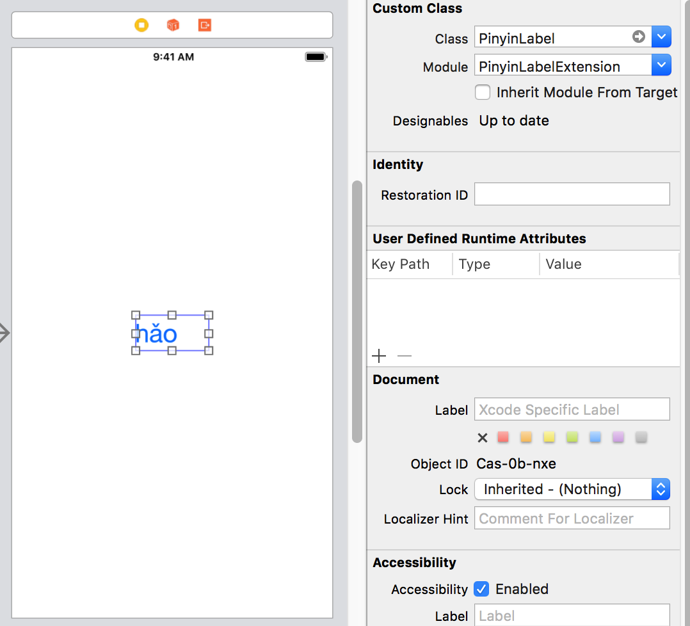

# Pinyin-UILabel-iOS
An iOS custom UILabel that can display Chinese pinyin with tone above



1. Installation

PinyinLabelExtension is available through CocoaPods. To install it, simply add the following line to your Podfile:

```
pod 'PinyinLabelExtension'
```

2. Use it as UILabel at the storyboard



3. You can use it in the code as noraml UILabel

```
pinyin.text = "Ni3"
```
